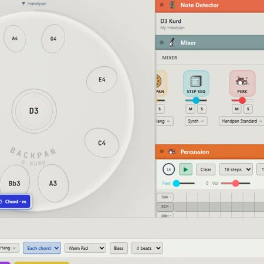
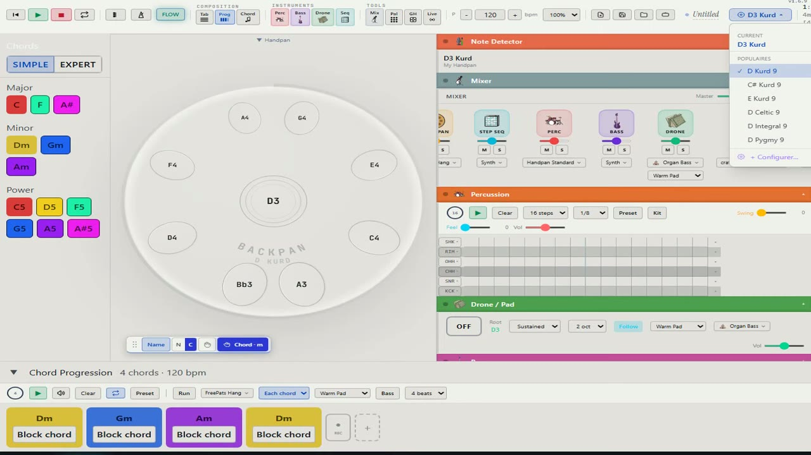
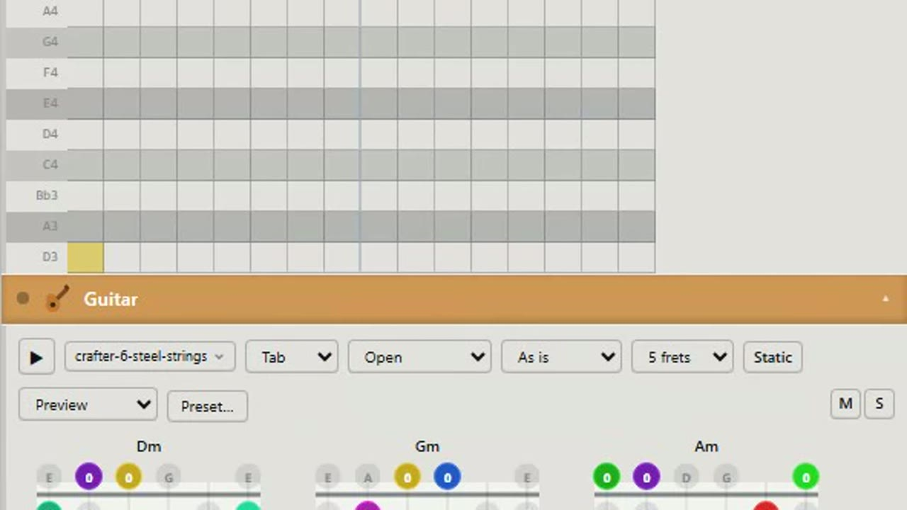

# Backpan

Studio de handpan en ligne. [backpan.fr](https://backpan.fr)

Backpan reproduit l'expérience du handpan dans le navigateur : jouer, s'enregistrer, explorer des gammes, sans matériel. En bêta avec des utilisateurs réels.

Ce dépôt est une vitrine : pas de code source ici, juste ce qu'il y a sous le capot. Le code vit dans un dépôt privé.

## Studio complet

Progression d'accords, séquenceur de percussions, drone/pad, sélection de gammes — tout piloté depuis une seule vue.

## Multi-instrument

Handpan, mais aussi guitare (tablature, accords, presets), pour composer au-delà du seul handpan.

## Stack

- **Frontend** : React, TypeScript, Tone.js (moteur audio)
- **Backend / data** : Supabase
- **Infra** : Docker, Traefik, Coolify, VPS auto-hébergé
- **CI/CD** : GitHub Actions

## Chiffres

- **3 959** tests automatisés (Vitest)
- **160** scénarios end-to-end (Playwright)
- **3 182** échantillons audio servis par CDN
- Benchmarks de latence audio exécutés en intégration continue à chaque changement
- ~350 pull requests depuis le début du projet

## Développement

Backpan est développé avec un workflow multi-agents sur Claude Code : répartition des tâches par modèle selon le coût et la criticité (planification vs exécution vs tâches mécaniques), worktrees git parallèles, et un point de validation humaine avant chaque merge. Architecture pensée self-hosted, avec minimisation des données collectées.

## Contact

Missions freelance en ingénierie d'agents LLM et intégration de systèmes.

- [Malt](https://www.malt.fr/profile/carmelohays1)
- [LinkedIn](https://www.linkedin.com/in/carmelohays)
